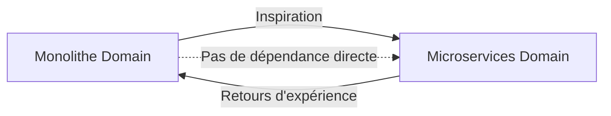

# 🏗️ Séparation du Domain Layer - Architecture

## 🎯 Décision Architecturale

**Date** : 17 Octobre 2025  
**Version** : 2.0.3

### Problème

Auparavant, les microservices référençaient le projet `src/KBA.Framework.Domain` du monolithe :

```
KBA.Framework/
├── src/
│   └── KBA.Framework.Domain/        ← Projet du monolithe
│       ├── Entities/
│       ├── Common/
│       └── ...
└── microservices/
    ├── KBA.ProductService/
    │   └── *.csproj                 ← Référence à ../../src/KBA.Framework.Domain
    ├── KBA.IdentityService/
    └── ...
```

**Problèmes** :
- ❌ **Couplage** : Les microservices dépendent du code du monolithe
- ❌ **Déploiement** : Besoin de `src/` pour compiler les microservices
- ❌ **Évolution** : Changements dans src/ impactent les microservices
- ❌ **Indépendance** : Les microservices ne sont pas vraiment autonomes

### Solution

Créer un projet **KBA.Framework.Domain séparé** dans le dossier `microservices/` :

```
KBA.Framework/
├── src/
│   └── KBA.Framework.Domain/        ← Pour le monolithe
│       └── ...
└── microservices/
    ├── KBA.Framework.Domain/        ← 🆕 Pour les microservices
    │   ├── Common/
    │   ├── Entities/
    │   └── KBAConsts.cs
    ├── KBA.ProductService/
    │   └── *.csproj                 ← Référence à ../KBA.Framework.Domain
    └── ...
```

**Avantages** :
- ✅ **Indépendance** : Les microservices sont totalement autonomes
- ✅ **Déploiement** : Pas besoin de `src/` pour compiler
- ✅ **Évolution** : Domaine des microservices évolue séparément
- ✅ **Clarté** : Séparation claire monolithe vs microservices

---

## 📊 Comparaison

| Aspect | **Avant** (src) | **Après** (microservices) |
|--------|-----------------|---------------------------|
| **Référence** | `../../src/KBA.Framework.Domain` | `../KBA.Framework.Domain` |
| **Dépendance** | Monolithe | Aucune |
| **Build** | Nécessite src/ | Autonome |
| **Déploiement** | Complexe | Simple |
| **Évolution** | Couplée | Indépendante |
| **CI/CD** | Pipeline unique | Pipelines séparés |

---

## 🔧 Modifications Apportées

### 1. Création du Nouveau Projet

**Fichier** : `microservices/KBA.Framework.Domain/KBA.Framework.Domain.csproj`

```xml
<Project Sdk="Microsoft.NET.Sdk">
  <PropertyGroup>
    <TargetFramework>net8.0</TargetFramework>
    <Nullable>enable</Nullable>
    <ImplicitUsings>enable</ImplicitUsings>
  </PropertyGroup>

  <ItemGroup>
    <PackageReference Include="Microsoft.EntityFrameworkCore" Version="8.0.0" />
  </ItemGroup>
</Project>
```

**Contenu copié** :
- ✅ `Common/Entity.cs`
- ✅ `Common/AggregateRoot.cs`
- ✅ `Common/ValueObject.cs`
- ✅ `Common/PagedResult.cs`
- ✅ `Common/ApiResponse.cs`
- ✅ `KBAConsts.cs`

**Entités créées** :
- ✅ `Entities/User.cs`
- ✅ `Entities/Role.cs`
- ✅ `Entities/UserRole.cs`
- ✅ `Entities/Product.cs`
- ✅ `Entities/Tenant.cs`
- ✅ `Entities/Permission.cs`
- ✅ `Entities/PermissionGrant.cs`

### 2. Mise à Jour des Références

**Fichiers modifiés** :
- `KBA.IdentityService.csproj`
- `KBA.ProductService.csproj`
- `KBA.TenantService.csproj`
- `KBA.PermissionService.csproj`

**Changement** :

```xml
<!-- AVANT -->
<ProjectReference Include="..\..\src\KBA.Framework.Domain\KBA.Framework.Domain.csproj" />

<!-- APRÈS -->
<ProjectReference Include="..\KBA.Framework.Domain\KBA.Framework.Domain.csproj" />
```

### 3. Mise à Jour de la Solution

**Fichier** : `KBA.Microservices.sln`

```diff
- Project("{...}") = "KBA.Framework.Domain", "..\..\src\KBA.Framework.Domain\KBA.Framework.Domain.csproj", "{...}"
+ Project("{...}") = "KBA.Framework.Domain", "KBA.Framework.Domain\KBA.Framework.Domain.csproj", "{...}"
```

### 4. Mise à Jour du Dockerfile

**Fichier** : `KBA.PermissionService/Dockerfile`

```dockerfile
# AVANT
COPY ["src/KBA.Framework.Domain/KBA.Framework.Domain.csproj", "src/KBA.Framework.Domain/"]

# APRÈS
COPY ["microservices/KBA.Framework.Domain/KBA.Framework.Domain.csproj", "microservices/KBA.Framework.Domain/"]
```

---

## 📁 Structure Complète

```
microservices/KBA.Framework.Domain/
├── KBA.Framework.Domain.csproj
├── README.md
├── KBAConsts.cs
├── Common/
│   ├── Entity.cs
│   ├── AggregateRoot.cs
│   ├── ValueObject.cs
│   ├── PagedResult.cs
│   └── ApiResponse.cs
└── Entities/
    ├── User.cs
    ├── Role.cs
    ├── UserRole.cs
    ├── Product.cs
    ├── Tenant.cs
    ├── Permission.cs
    └── PermissionGrant.cs
```

**Total** : 
- 1 projet .csproj
- 1 README.md
- 1 fichier de constantes
- 5 classes communes
- 7 entités

---

## 🔄 Migration Path

### Pour les Développeurs

**Avant de pull** :

```bash
git pull
cd microservices
dotnet restore
dotnet build
```

**Aucune action requise** ! Les références sont mises à jour automatiquement.

### Pour CI/CD

**Avant** :
```yaml
# Build nécessitait src/ et microservices/
- checkout: src/
- checkout: microservices/
- dotnet build microservices/KBA.ProductService
```

**Après** :
```yaml
# Build autonome
- checkout: microservices/
- dotnet build microservices/KBA.ProductService
```

---

## 🎯 Principes Architecturaux

### 1. Bounded Contexts

Chaque microservice a son **propre contexte borné** :

```
KBA.IdentityService     → User, Role, UserRole
KBA.ProductService      → Product
KBA.TenantService       → Tenant
KBA.PermissionService   → Permission, PermissionGrant
```

Tous partagent les **classes de base** (`Entity`, `AggregateRoot`, etc.)

### 2. Shared Kernel

`KBA.Framework.Domain` est le **Shared Kernel** des microservices :

```
Shared Kernel (KBA.Framework.Domain)
    ↓
┌───────────┬───────────┬───────────┐
│ Identity  │ Product   │ Permission│
│ Service   │ Service   │ Service   │
└───────────┴───────────┴───────────┘
```

**Contient uniquement** :
- Classes de base (Entity, AggregateRoot)
- Interfaces communes
- Value Objects communs
- DTOs partagés (PagedResult, ApiResponse)

**Ne contient PAS** :
- Logique métier spécifique
- Services applicatifs
- Infrastructure

### 3. Autonomie des Services

Chaque service peut :
- ✅ Être compilé indépendamment
- ✅ Être déployé indépendamment
- ✅ Évoluer indépendamment
- ✅ Avoir ses propres entités spécifiques

```csharp
// Product Service peut ajouter ses propres entités
namespace KBA.ProductService.Domain;

public class ProductCategory : Entity  // Hérite de KBA.Framework.Domain
{
    // Spécifique à Product Service
}
```

---

## 🚀 Évolution Future

### Stratégie de Versioning

**Shared Kernel** :
- Version indépendante : `KBA.Framework.Domain.Microservices v2.0`
- Changelog séparé
- Releases coordonnées

**Services** :
- Versions indépendantes
- Peuvent utiliser des versions différentes du Shared Kernel (si compatibilité)

### Synchronisation avec le Monolithe

**Approche** :
1. **Divergence contrôlée** : Les deux peuvent évoluer séparément
2. **Synchronisation manuelle** : Copie des concepts utiles si besoin
3. **Pas de couplage** : Pas de dépendance entre les deux

**Workflow** :



---

## ✅ Checklist de Vérification

### Après Migration

- [x] Projet `KBA.Framework.Domain` créé dans `microservices/`
- [x] Toutes les classes Common copiées
- [x] Toutes les entités créées
- [x] Références des services mises à jour
- [x] Solution (.sln) mise à jour
- [x] Dockerfile mis à jour
- [x] README.md créé
- [x] Build réussit ✅

### Tests

```bash
# 1. Restore
cd microservices
dotnet restore

# 2. Build
dotnet build KBA.Framework.Domain/KBA.Framework.Domain.csproj
dotnet build KBA.ProductService/KBA.ProductService.csproj
dotnet build KBA.IdentityService/KBA.IdentityService.csproj
dotnet build KBA.TenantService/KBA.TenantService.csproj
dotnet build KBA.PermissionService/KBA.PermissionService.csproj

# 3. Build complet
dotnet build KBA.Microservices.sln
```

**Résultat attendu** : Tous les builds réussissent ✅

---

## 📚 Documentation Associée

| Document | Description |
|----------|-------------|
| [KBA.Framework.Domain/README.md](./KBA.Framework.Domain/README.md) | Documentation du projet Domain |
| [CHANGELOG.md](./CHANGELOG.md) | Historique des versions |
| [INDEX-DOCUMENTATION.md](./INDEX-DOCUMENTATION.md) | Index de la doc |

---

## 🎉 Bénéfices

### Immédiat

- ✅ **Autonomie** : Les microservices ne dépendent plus du monolithe
- ✅ **Simplicité** : Build plus simple et rapide
- ✅ **Clarté** : Séparation claire des responsabilités

### Moyen Terme

- ✅ **CI/CD** : Pipelines indépendants possibles
- ✅ **Déploiement** : Services déployables séparément
- ✅ **Évolution** : Modifications du monolithe n'impactent pas les microservices

### Long Terme

- ✅ **Scalabilité** : Chaque service peut évoluer à son rythme
- ✅ **Maintenance** : Code plus facile à maintenir
- ✅ **Migration** : Facilite la migration complète vers microservices

---

## 🎯 Conclusion

La **séparation du Domain Layer** est une décision architecturale majeure qui :

1. **Renforce l'autonomie** des microservices
2. **Simplifie le déploiement** et le build
3. **Facilite l'évolution** indépendante
4. **Améliore la clarté** du code

**Status** : ✅ Implémenté et testé  
**Impact** : Tous les services  
**Risque** : Faible (changement transparent)  
**Bénéfice** : Élevé (autonomie, clarté, simplicité)

---

**Version** : 2.0.3  
**Date** : 17 Octobre 2025  
**Auteur** : Architecture Team
